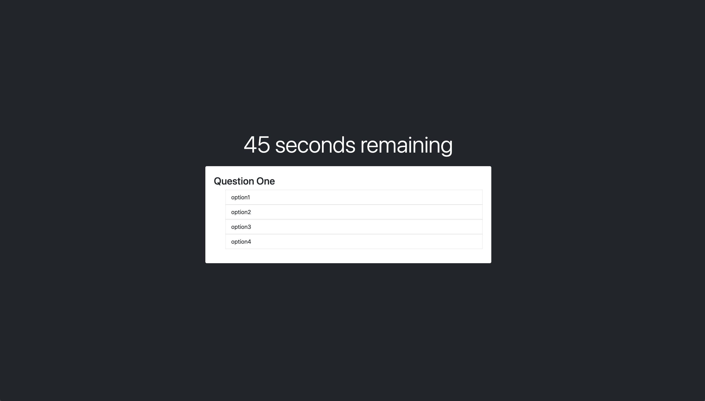

# code-quiz

## Description

The goal of this project is to design a quiz that runs in browser and allows you to select multiple choice answers. Once complete you can record your initials and score in a locally stored high scores data set.

## Usage

To use this project, open the index.html in browser or follow the website link and click the start button. Each question can be answered by clicking one of the choices listed, but incorrect choices will remove time from the timer. Once all questions have been answered correctly or time runs out, your score will be equal to your time left.

 

## Credits

I borrowed source code from module 5.16 in the UPENN LPS bootcamp repo to get the groundwork for the basic layout of the webpage. 

I also borrowed code from module 4.10 to help with the timer running in the project.

I used the [following link](https://stackoverflow.com/questions/19602292/looping-through-array-using-a-button) to help me figure out my nextQuestion() function, which was not behaving properly.

## License

Standard MIT License.
